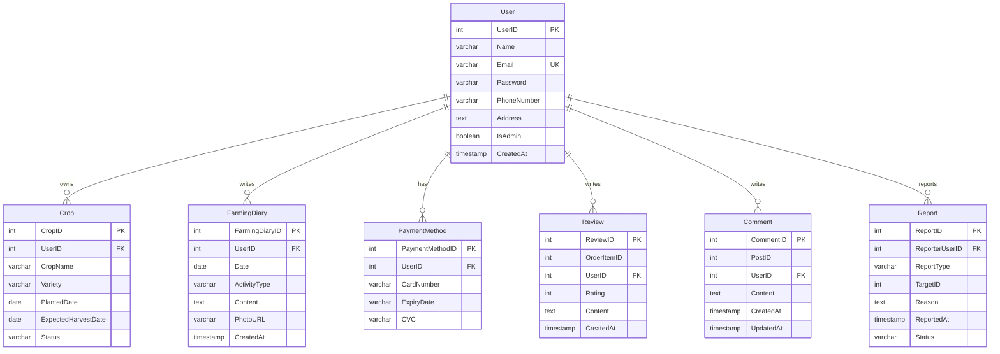

# Samyang 농업 플랫폼 프로젝트 기획서

## 1. 프로젝트 개요

### 1.1 프로젝트 목적
- **프로젝트명**: Samyang 농업 플랫폼
- **프로젝트 성격**: 대학교 과제용 농업 관리 시스템
- **개발 목표**: 기본적인 CRUD 기능 구현을 통한 농업 관련 데이터 관리
- **우선순위**: 보안보다는 **기능의 정상 동작**을 최우선으로 함

### 1.2 시스템 개요
농업인들의 작물 관리, 농업 일지 작성, 리뷰 시스템, 커뮤니티 기능을 제공하는 웹 기반 농업 플랫폼입니다.

### 1.3 주요 기능
- **사용자 관리**: 회원가입, 로그인, 프로필 관리
- **작물 관리**: 작물 등록, 조회, 수정, 삭제
- **농업 일지**: 일지 작성, 조회, 수정, 삭제
- **결제 관리**: 결제 수단 등록 및 관리
- **리뷰 시스템**: 상품/서비스 리뷰 작성 및 관리
- **커뮤니티**: 댓글 시스템
- **신고 관리**: 부적절한 콘텐츠 신고 처리

### 1.4 구현 범위
- **전체 엔티티**: 7개 테이블 모두 구현
  - User (사용자)
  - Crop (작물)
  - FarmingDiary (농업일지)
  - PaymentMethod (결제수단)
  - Review (리뷰)
  - Comment (댓글)
  - Report (신고)

## 2. 기술 스택 및 시스템 구조

### 2.1 기술 스택
```
Frontend: JSP (Java Server Pages)
Backend: Spring Boot 3.x
Database: MySQL 8.x
ORM: MyBatis
Build Tool: Gradle
JDK: Java 17
Server: Embedded Tomcat
```

### 2.2 시스템 아키텍처
```
[Browser] ↔ [JSP Views] ↔ [Spring MVC Controllers] ↔ [Service Layer] ↔ [MyBatis Mappers] ↔ [MySQL Database]
```

### 2.3 개발 환경
- **IDE**: IntelliJ IDEA / Eclipse
- **Database**: MySQL (호스트: 34.47.105.223)
- **Database Name**: samyang
- **패키지 구조**: com.farm404.samyang

### 2.4 MVC 패턴 구조
```
Controller Layer: HTTP 요청 처리, 응답 반환
Service Layer: 비즈니스 로직 처리
Repository Layer: 데이터 액세스 (MyBatis Mapper)
View Layer: JSP를 통한 화면 렌더링
```

## 3. 데이터베이스 설계

### 3.1 ERD (Entity Relationship Diagram)


### 3.2 테이블 상세 구조

#### 3.2.1 User 테이블
| 컬럼명 | 데이터타입 | 제약조건 | 설명 |
|--------|------------|-----------|------|
| UserID | INT | PK, AUTO_INCREMENT | 사용자 고유 ID |
| Name | VARCHAR(255) | NOT NULL | 사용자 이름 |
| Email | VARCHAR(255) | NOT NULL, UNIQUE | 이메일 (로그인 ID) |
| Password | VARCHAR(255) | NOT NULL | 비밀번호 |
| PhoneNumber | VARCHAR(50) | | 전화번호 |
| Address | TEXT | | 주소 |
| IsAdmin | BOOLEAN | DEFAULT FALSE | 관리자 여부 |
| CreatedAt | TIMESTAMP | DEFAULT CURRENT_TIMESTAMP | 생성일시 |

#### 3.2.2 Crop 테이블
| 컬럼명 | 데이터타입 | 제약조건 | 설명 |
|--------|------------|-----------|------|
| CropID | INT | PK, AUTO_INCREMENT | 작물 고유 ID |
| UserID | INT | FK, NOT NULL | 사용자 ID |
| CropName | VARCHAR(255) | NOT NULL | 작물 이름 |
| Variety | VARCHAR(255) | | 품종 |
| PlantedDate | DATE | | 식재일 |
| ExpectedHarvestDate | DATE | | 예상 수확일 |
| Status | VARCHAR(50) | | 작물 상태 |

#### 3.2.3 FarmingDiary 테이블
| 컬럼명 | 데이터타입 | 제약조건 | 설명 |
|--------|------------|-----------|------|
| FarmingDiaryID | INT | PK, AUTO_INCREMENT | 농업일지 고유 ID |
| UserID | INT | FK, NOT NULL | 사용자 ID |
| Date | DATE | NOT NULL | 일지 날짜 |
| ActivityType | VARCHAR(100) | | 활동 유형 |
| Content | TEXT | | 일지 내용 |
| PhotoURL | VARCHAR(500) | | 사진 URL |
| CreatedAt | TIMESTAMP | DEFAULT CURRENT_TIMESTAMP | 생성일시 |

#### 3.2.4 PaymentMethod 테이블
| 컬럼명 | 데이터타입 | 제약조건 | 설명 |
|--------|------------|-----------|------|
| PaymentMethodID | INT | PK, AUTO_INCREMENT | 결제수단 고유 ID |
| UserID | INT | FK, NOT NULL | 사용자 ID |
| CardNumber | VARCHAR(20) | NOT NULL | 카드번호 |
| ExpiryDate | VARCHAR(10) | NOT NULL | 만료일 |
| CVC | VARCHAR(5) | NOT NULL | CVC |

#### 3.2.5 Review 테이블
| 컬럼명 | 데이터타입 | 제약조건 | 설명 |
|--------|------------|-----------|------|
| ReviewID | INT | PK, AUTO_INCREMENT | 리뷰 고유 ID |
| OrderItemID | INT | NOT NULL | 주문 아이템 ID |
| UserID | INT | FK, NOT NULL | 사용자 ID |
| Rating | INT | NOT NULL | 평점 (1-5) |
| Content | TEXT | | 리뷰 내용 |
| CreatedAt | TIMESTAMP | DEFAULT CURRENT_TIMESTAMP | 생성일시 |

#### 3.2.6 Comment 테이블
| 컬럼명 | 데이터타입 | 제약조건 | 설명 |
|--------|------------|-----------|------|
| CommentID | INT | PK, AUTO_INCREMENT | 댓글 고유 ID |
| PostID | INT | NOT NULL | 게시글 ID |
| UserID | INT | FK, NOT NULL | 사용자 ID |
| Content | TEXT | NOT NULL | 댓글 내용 |
| CreatedAt | TIMESTAMP | DEFAULT CURRENT_TIMESTAMP | 생성일시 |
| UpdatedAt | TIMESTAMP | DEFAULT CURRENT_TIMESTAMP ON UPDATE CURRENT_TIMESTAMP | 수정일시 |

#### 3.2.7 Report 테이블
| 컬럼명 | 데이터타입 | 제약조건 | 설명 |
|--------|------------|-----------|------|
| ReportID | INT | PK, AUTO_INCREMENT | 신고 고유 ID |
| ReporterUserID | INT | FK, NOT NULL | 신고자 ID |
| ReportType | VARCHAR(50) | NOT NULL | 신고 유형 |
| TargetID | INT | NOT NULL | 신고 대상 ID |
| Reason | TEXT | | 신고 사유 |
| ReportedAt | TIMESTAMP | DEFAULT CURRENT_TIMESTAMP | 신고일시 |
| Status | VARCHAR(20) | DEFAULT 'PENDING' | 처리 상태 |

## 4. 엔티티별 CRUD 기능 명세

### 4.1 User (사용자) CRUD
- **Create**: 회원가입 (이메일, 비밀번호, 이름, 전화번호, 주소)
- **Read**: 
  - 사용자 목록 조회 (관리자만)
  - 사용자 상세 정보 조회
  - 로그인 처리
- **Update**: 
  - 프로필 정보 수정 (이름, 전화번호, 주소)
  - 비밀번호 변경
- **Delete**: 회원 탈퇴

### 4.2 Crop (작물) CRUD
- **Create**: 새 작물 등록 (작물명, 품종, 식재일, 예상수확일)
- **Read**: 
  - 내 작물 목록 조회
  - 작물 상세 정보 조회
  - 작물 상태별 필터링
- **Update**: 작물 정보 수정 (품종, 예상수확일, 상태)
- **Delete**: 작물 삭제

### 4.3 FarmingDiary (농업일지) CRUD
- **Create**: 새 일지 작성 (날짜, 활동유형, 내용, 사진)
- **Read**: 
  - 내 일지 목록 조회 (날짜순 정렬)
  - 일지 상세 조회
  - 월별/기간별 일지 조회
- **Update**: 일지 수정 (활동유형, 내용, 사진)
- **Delete**: 일지 삭제

### 4.4 PaymentMethod (결제수단) CRUD
- **Create**: 새 결제수단 등록 (카드번호, 만료일, CVC)
- **Read**: 
  - 내 결제수단 목록 조회
  - 결제수단 상세 조회
- **Update**: 결제수단 정보 수정
- **Delete**: 결제수단 삭제

### 4.5 Review (리뷰) CRUD
- **Create**: 새 리뷰 작성 (주문아이템ID, 평점, 내용)
- **Read**: 
  - 리뷰 목록 조회 (평점순, 최신순)
  - 내가 작성한 리뷰 조회
  - 리뷰 상세 조회
- **Update**: 리뷰 수정 (평점, 내용)
- **Delete**: 리뷰 삭제

### 4.6 Comment (댓글) CRUD
- **Create**: 새 댓글 작성 (게시글ID, 내용)
- **Read**: 
  - 게시글별 댓글 목록 조회
  - 내가 작성한 댓글 조회
- **Update**: 댓글 수정 (내용)
- **Delete**: 댓글 삭제

### 4.7 Report (신고) CRUD
- **Create**: 새 신고 접수 (신고유형, 대상ID, 사유)
- **Read**: 
  - 신고 목록 조회 (관리자만)
  - 내가 접수한 신고 조회
  - 신고 상세 조회
- **Update**: 신고 처리 상태 변경 (관리자만)
- **Delete**: 신고 삭제 (관리자만)
## 5. API 엔드포인트 설계

### 5.1 User 관련 API
```
GET    /users                    # 사용자 목록 조회 (관리자만)
GET    /users/{id}              # 사용자 상세 조회
POST   /users                   # 회원가입
PUT    /users/{id}              # 사용자 정보 수정
DELETE /users/{id}              # 회원 탈퇴
POST   /users/login             # 로그인
POST   /users/logout            # 로그아웃
```

### 5.2 Crop 관련 API
```
GET    /crops                   # 내 작물 목록 조회
GET    /crops/{id}              # 작물 상세 조회
POST   /crops                   # 새 작물 등록
PUT    /crops/{id}              # 작물 정보 수정
DELETE /crops/{id}              # 작물 삭제
GET    /crops?status={status}   # 상태별 작물 조회
```

### 5.3 FarmingDiary 관련 API
```
GET    /farming-diary           # 내 농업일지 목록 조회
GET    /farming-diary/{id}      # 농업일지 상세 조회
POST   /farming-diary           # 새 농업일지 작성
PUT    /farming-diary/{id}      # 농업일지 수정
DELETE /farming-diary/{id}      # 농업일지 삭제
GET    /farming-diary?date={date} # 날짜별 일지 조회
```

### 5.4 PaymentMethod 관련 API
```
GET    /payment-methods         # 내 결제수단 목록 조회
GET    /payment-methods/{id}    # 결제수단 상세 조회
POST   /payment-methods         # 새 결제수단 등록
PUT    /payment-methods/{id}    # 결제수단 수정
DELETE /payment-methods/{id}    # 결제수단 삭제
```

### 5.5 Review 관련 API
```
GET    /reviews                 # 리뷰 목록 조회
GET    /reviews/{id}            # 리뷰 상세 조회
POST   /reviews                 # 새 리뷰 작성
PUT    /reviews/{id}            # 리뷰 수정
DELETE /reviews/{id}            # 리뷰 삭제
GET    /reviews/my              # 내가 작성한 리뷰 조회
```

### 5.6 Comment 관련 API
```
GET    /comments?postId={postId} # 게시글별 댓글 목록
GET    /comments/{id}           # 댓글 상세 조회
POST   /comments                # 새 댓글 작성  
PUT    /comments/{id}           # 댓글 수정
DELETE /comments/{id}           # 댓글 삭제
GET    /comments/my             # 내가 작성한 댓글 조회
```

### 5.7 Report 관련 API
```
GET    /reports                 # 신고 목록 조회 (관리자만)
GET    /reports/{id}            # 신고 상세 조회
POST   /reports                 # 새 신고 접수
PUT    /reports/{id}            # 신고 처리 상태 변경 (관리자만)
DELETE /reports/{id}            # 신고 삭제 (관리자만)
GET    /reports/my              # 내가 접수한 신고 조회
```

## 6. JSP 화면 설계

### 6.1 User 관련 화면
- **login.jsp**: 로그인 화면
- **register.jsp**: 회원가입 화면
- **profile.jsp**: 프로필 조회/수정 화면
- **users.jsp**: 사용자 목록 화면 (관리자만)

### 6.2 Crop 관련 화면
- **crop-list.jsp**: 작물 목록 화면
- **crop-detail.jsp**: 작물 상세 화면
- **crop-form.jsp**: 작물 등록/수정 폼 화면

### 6.3 FarmingDiary 관련 화면
- **diary-list.jsp**: 농업일지 목록 화면
- **diary-detail.jsp**: 농업일지 상세 화면
- **diary-form.jsp**: 농업일지 작성/수정 폼 화면
- **diary-calendar.jsp**: 달력 형태의 일지 조회 화면

### 6.4 PaymentMethod 관련 화면
- **payment-list.jsp**: 결제수단 목록 화면
- **payment-form.jsp**: 결제수단 등록/수정 폼 화면

### 6.5 Review 관련 화면
- **review-list.jsp**: 리뷰 목록 화면
- **review-detail.jsp**: 리뷰 상세 화면
- **review-form.jsp**: 리뷰 작성/수정 폼 화면

### 6.6 Comment 관련 화면
- **comment-list.jsp**: 댓글 목록 화면 (게시글 내 포함)
- **comment-form.jsp**: 댓글 작성/수정 폼 화면

### 6.7 Report 관련 화면
- **report-list.jsp**: 신고 목록 화면 (관리자만)
- **report-detail.jsp**: 신고 상세 화면
- **report-form.jsp**: 신고 접수 폼 화면

### 6.8 공통 화면
- **header.jsp**: 공통 헤더 (네비게이션)
- **footer.jsp**: 공통 푸터
- **sidebar.jsp**: 사이드바 메뉴
- **index.jsp**: 메인 대시보드 화면

## 7. 패키지 구조 및 파일 구성

### 7.1 Java 패키지 구조
```
src/main/java/com/farm404/samyang/
├── SamyangApplication.java              # Spring Boot 메인 클래스
├── config/                              # 설정 클래스
│   ├── WebConfig.java                   # 웹 설정
│   └── DatabaseConfig.java             # 데이터베이스 설정
├── controller/                          # 컨트롤러 레이어
│   ├── UserController.java
│   ├── CropController.java
│   ├── FarmingDiaryController.java
│   ├── PaymentMethodController.java
│   ├── ReviewController.java
│   ├── CommentController.java
│   └── ReportController.java
├── service/                             # 서비스 레이어
│   ├── UserService.java
│   ├── CropService.java
│   ├── FarmingDiaryService.java
│   ├── PaymentMethodService.java
│   ├── ReviewService.java
│   ├── CommentService.java
│   └── ReportService.java
├── dto/                                 # 데이터 전송 객체
│   ├── UserDto.java
│   ├── CropDto.java
│   ├── FarmingDiaryDto.java
│   ├── PaymentMethodDto.java
│   ├── ReviewDto.java
│   ├── CommentDto.java
│   └── ReportDto.java
├── mapper/                              # MyBatis 매퍼 인터페이스
│   ├── UserMapper.java
│   ├── CropMapper.java
│   ├── FarmingDiaryMapper.java
│   ├── PaymentMethodMapper.java
│   ├── ReviewMapper.java
│   ├── CommentMapper.java
│   └── ReportMapper.java
└── util/                                # 유틸리티 클래스
    ├── DateUtil.java
    └── SecurityUtil.java
```

### 7.2 리소스 구조
```
src/main/resources/
├── application.yml                      # Spring Boot 설정
├── static/                              # 정적 리소스
│   ├── css/
│   │   └── style.css
│   ├── js/
│   │   └── main.js
│   └── images/
└── mapper/                              # MyBatis XML 매퍼
    ├── UserMapper.xml
    ├── CropMapper.xml
    ├── FarmingDiaryMapper.xml
    ├── PaymentMethodMapper.xml
    ├── ReviewMapper.xml
    ├── CommentMapper.xml
    └── ReportMapper.xml
```

### 7.3 JSP 뷰 구조
```
src/main/webapp/WEB-INF/views/
├── common/                              # 공통 JSP
│   ├── header.jsp
│   ├── footer.jsp
│   └── sidebar.jsp
├── user/                                # 사용자 관련 JSP
│   ├── login.jsp
│   ├── register.jsp
│   ├── profile.jsp
│   └── users.jsp
├── crop/                                # 작물 관련 JSP
│   ├── crop-list.jsp
│   ├── crop-detail.jsp
│   └── crop-form.jsp
├── farming-diary/                       # 농업일지 관련 JSP
│   ├── diary-list.jsp
│   ├── diary-detail.jsp
│   ├── diary-form.jsp
│   └── diary-calendar.jsp
├── payment/                             # 결제수단 관련 JSP
│   ├── payment-list.jsp
│   └── payment-form.jsp
├── review/                              # 리뷰 관련 JSP
│   ├── review-list.jsp
│   ├── review-detail.jsp
│   └── review-form.jsp
├── comment/                             # 댓글 관련 JSP
│   ├── comment-list.jsp
│   └── comment-form.jsp
├── report/                              # 신고 관련 JSP
│   ├── report-list.jsp
│   ├── report-detail.jsp
│   └── report-form.jsp
└── index.jsp                            # 메인 대시보드
```

## 8. 개발 우선순위 및 단계별 일정

### 8.1 개발 단계별 우선순위

#### 1단계: 기본 인프라 구축 (1-2일)
- Spring Boot 프로젝트 기본 설정
- 데이터베이스 연결 설정
- MyBatis 설정
- 기본 패키지 구조 생성

#### 2단계: 사용자 관리 구현 (2-3일)
- **User 엔티티 우선 구현** (모든 기능의 기반)
- 회원가입, 로그인, 로그아웃 기능
- 사용자 프로필 관리
- 세션 관리

#### 3단계: 농업 핵심 기능 구현 (3-4일)
- **Crop 엔티티 구현**
  - 작물 등록, 조회, 수정, 삭제
  - 작물 상태 관리
- **FarmingDiary 엔티티 구현**
  - 농업일지 작성, 조회, 수정, 삭제
  - 사진 업로드 기능

#### 4단계: 부가 기능 구현 (2-3일)
- **PaymentMethod 엔티티 구현**
  - 결제수단 등록 및 관리
- **Review 엔티티 구현**
  - 리뷰 작성 및 관리
  - 평점 시스템

#### 5단계: 커뮤니티 기능 구현 (2일)
- **Comment 엔티티 구현**
  - 댓글 작성, 수정, 삭제
- **Report 엔티티 구현**
  - 신고 접수 및 처리

#### 6단계: UI/UX 개선 및 테스트 (2-3일)
- JSP 화면 디자인 개선
- 반응형 웹 적용
- 기능 테스트 및 버그 수정

### 8.2 예상 총 개발 기간
- **총 개발 기간**: 약 12-18일
- **핵심 기능 완성**: 10일 이내
- **완성도 높은 결과물**: 15일 이내

### 8.3 개발 시 주의사항
1. **기능 동작 최우선**: 보안보다는 기능의 정상 동작에 집중
2. **단계별 테스트**: 각 단계별로 기능 테스트 수행
3. **User 엔티티 우선**: 다른 모든 기능의 기반이므로 먼저 완성
4. **데이터 검증**: 기본적인 입력값 검증은 구현
5. **에러 처리**: 간단한 에러 페이지 및 메시지 처리
6. **아키텍처**: 대학생과제 수준의 초간단 아키텍쳐


### 8.4 최종 목표
- 7개 테이블의 완전한 CRUD 기능 구현
- 직관적이고 사용하기 쉬운 웹 인터페이스
- 안정적으로 동작하는 농업 플랫폼 시스템

---

## 마무리

본 기획서는 대학교 과제용 농업 플랫폼 개발을 위한 상세한 계획서입니다. Spring Boot, JSP, MySQL, MyBatis를 활용하여 7개 엔티티의 완전한 CRUD 기능을 구현하는 것을 목표로 합니다. 

기능의 정상 동작을 최우선으로 하며, 단계별 개발을 통해 체계적으로 프로젝트를 진행할 수 있도록 구성했습니다.